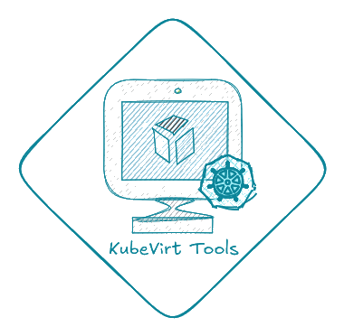

<p align="center">
  
</p>

# KubeVirt Tools

Phoenix web app for **cluster-wide KubeVirt and Kubernetes visibility**: sign in with a kubeconfig, then explore a LiveView dashboard backed by a one-shot API snapshot (refresh on demand).

## What you get

- **Dashboard** — VM / VMI counts, node capacity charts, PVC breakdowns, optional **Prometheus** overlays for cluster usage and node CPU/memory when metrics-server is missing.
- **VMs** — VirtualMachine list with VMI join and orphan VMI section.
- **Networks** — Template interfaces vs live VMI network data.
- **Disks** — Volume and PVC-backed disk detail.
- **Storage classes** — `StorageClass` inventory with provisioner, reclaim policy, binding mode, expansion, parameters, and PVC counts (plus warnings for mismatched PVC references).
- **Nodes** — Kubernetes Nodes with scheduling, metrics, and VMI counts.
- **Topology** — Interactive node ↔ VM graph (vis-network).
- **Export** — CSV / XLSX downloads of VM inventory.
- **Metrics** — App exposes **`GET /metrics`** in Prometheus text format for scraping.

## Based on / inspired by

Ideas and goals here overlap with tools that help operators **see, export, and reason about** virtual infrastructure:

- **[RVTools](https://www.dell.com/en-us/shop/vmware/sl/rvtools)** — the well-known VMware vSphere inventory and reporting workflow (spreadsheet-friendly exports, environment-wide visibility).
- **[OVTools](https://github.com/linuxelitebr/ovtools-release)** (OpenShift Virtualization Tools) — RVTools-style consolidated inventory and reporting for **OpenShift Virtualization** / Kubernetes-native VMs across namespaces, rather than stitching together `kubectl` / YAML by hand.
- **[KubeVirt Manager](https://github.com/kubevirt-manager/kubevirt-manager)** — a web UI focused on operating KubeVirt day to day (VMs, storage, monitoring, and related resources).

KubeVirt Tools is not affiliated with those projects; it is an independent Phoenix app aimed at similar **cluster-wide clarity** on plain KubeVirt clusters.

## Requirements

- Elixir & Erlang installed.
- `mix` command available in $PATH
- A cluster reachable with the uploaded kubeconfig (KubeVirt CRDs where applicable)

## Quick start

```bash
mix setup
mix phx.server
```

Open [http://localhost:4000](http://localhost:4000) and upload a valid kubeconfig.

---

## Configuration

### Environment variables

| Variable | Required | Default | Purpose |
|----------|----------|---------|---------|
| `PORT` | No | `4000` | HTTP listen port (see `config/runtime.exs`). |
| `PHX_SERVER` | For releases | — | If set (any value), enables the web server (`server: true` on the endpoint). Example: `PHX_SERVER=true bin/kubevirt_tools start`. |
| `SECRET_KEY_BASE` | **Yes** in `:prod` | — | Secret for signing cookies and tokens. Generate with `mix phx.gen.secret`. |
| `PHX_HOST` | No (`:prod`) | `example.com` | Public host used in `url:` for the endpoint (production). |
| `PROMETHEUS_URL` | No | `http://localhost:9090` | Base URL for the Prometheus HTTP API (`/api/v1/query`, `/-/healthy`). Trimmed whitespace; set when Prometheus is not on localhost. |

### Application config (`config :kubevirt_tools, …`)

The following are **not** environment variables today; they live in `config/config.exs` (and can be overridden in `config/runtime.exs`, `config/dev.exs`, or `config/prod.exs` for your deployment). Values below are the defaults from `config/config.exs`.

| Key | Default | Purpose |
|-----|---------|---------|
| `:kubeconfig_max_bytes` | `512_000` | Maximum kubeconfig upload size (bytes). |
| `:kubeconfig_connect_timeout_ms` | `12_000` | Timeout for the Kubernetes API reachability check at sign-in. |
| `:prometheus_client_timeout_ms` | `5_000` | Timeout for each Prometheus HTTP client call. |
| `:prometheus_poll_interval_ms` | `300_000` | Interval between **full** Prometheus snapshots (PromQL + node metrics) pushed to the dashboard. |
| `:prometheus_health_interval_ms` | `60_000` | After a successful snapshot, how often to call Prometheus **`/-/healthy`** so the UI drops “Connected” quickly if the server stops responding. |

---

## Learn more

- [Phoenix Framework](https://www.phoenixframework.org/)
- [Phoenix guides](https://hexdocs.pm/phoenix/overview.html)
- [KubeVirt](https://kubevirt.io/)
